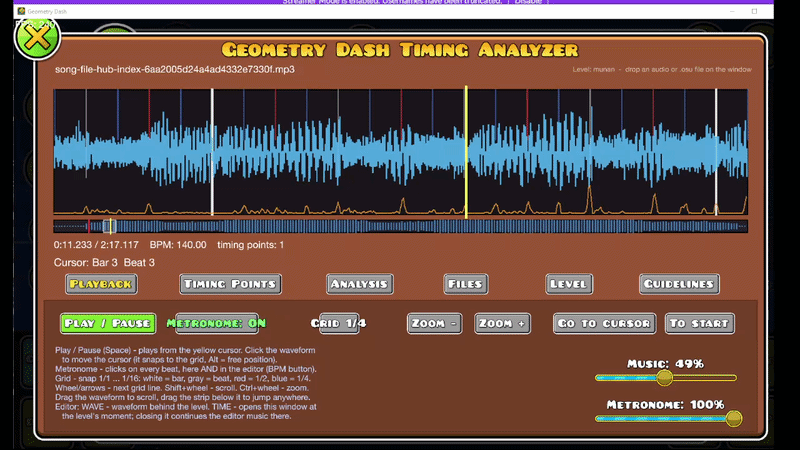
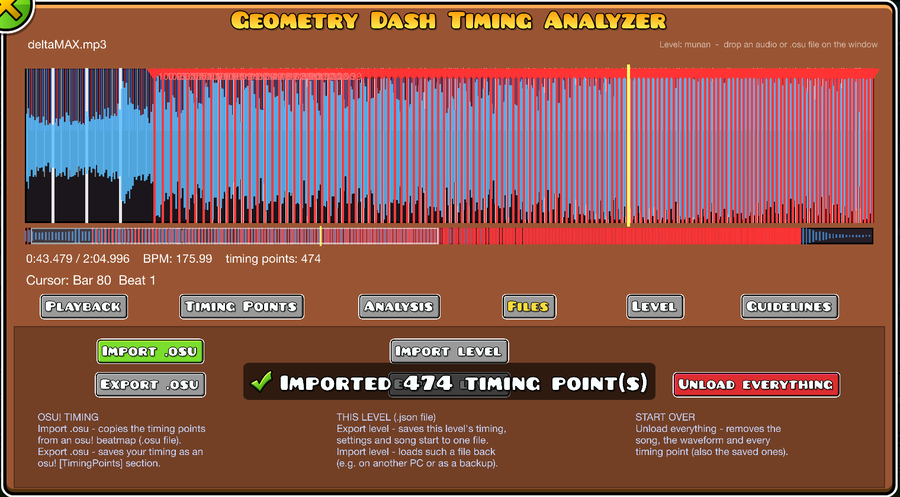
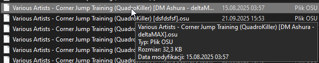

# Geometry Dash Timing Analyzer

An osu!-style timing analyzer for the Geometry Dash level editor (Geode mod) by

> 🤖 **Created with AI**: This mod was built and generated using **Claude Opus 5.5**. Feel free to fork, modify, and adapt it for your own projects!

Load a song, see its waveform, let the mod find the BPM, tempo changes and first beat, fine-tune the
timing points like in osu!, and build your level exactly on the beat.

## Features

- **Waveform** with a beat grid (1/1 ... 1/16), zoom and scrolling
- **Automatic analysis** of the BPM, tempo changes and first beat
- **Editable timing points**: time, BPM, beats per bar, x2 / ÷2, downbeat, tap tempo
- **osu! beatmap import / export**, see [below](#importing-osu-beatmaps)
- **Metronome** shared by the timing window and the editor, with volume sliders
- **Editor buttons** next to the music button: **BPM** (metronome), **WAVE** (waveform behind the level),
  **TIME** (opens the timing window at the level's moment and continues from there when closed)
- **Guidelines** made from your timing, **song start offset** set from the waveform cursor
- **Local songs**: a level can play any mp3 / ogg / wav / flac from your PC (works with Jukebox NONGs)
- **Per-level data**: every level has its own song, timing and settings, exportable as one file

<table>
  <tr>
    <th width="50%">Metronome, beat counter and waveform behind the level</th>
    <th width="50%">Bar / beat of the selected object</th>
  </tr>
  <tr>
    <td></td>
    <td></td>
  </tr>
</table>

## Importing osu! beatmaps

Already have a timed osu! map for your song? Take its timing straight into Geometry Dash.

1. **Drag a `.osu` file onto the game window**, or use **Files → Import .osu**.
2. Pick the right file: every difficulty is its own `.osu` in the beatmap folder (`osu!/Songs/<beatmap>/`),
   named `Artist - Title (Mapper) [Difficulty].osu`.

   

- All **red (uninherited) timing points** are copied (time, BPM, beats per bar), including every BPM change
  (the screenshot shows 474 points from one map). Green slider-velocity points are skipped.
- If the beatmap's audio file is next to the `.osu` and no song is loaded yet, **the song is loaded too**.
- The result is a normal timing map: edit it, use the metronome, make guidelines from it.
- **Files → Export .osu** does the opposite: it saves your timing as an osu! `[TimingPoints]` section.

## Usage

Open it with **Custom Song → Timing** or the **TIME** button in the editor, or drag an audio / `.osu` file
onto the game window. Every tab has a short description of its buttons.

## Installation

Needs **Geometry Dash 2.2081** on **Windows** and **[Geode](https://geode-sdk.org)** 5.10.1 or newer.

1. Download `bychke.gd-timing-analyzer.geode` from [Releases](../../releases)
2. Put it in the `geode/mods` folder of your Geometry Dash
3. Restart the game

> Local songs exist only on your PC: other players won't hear them if you upload the level.

## Building

Needs the [Geode SDK](https://docs.geode-sdk.org/getting-started/sdk) (`GEODE_SDK` variable), the Geode CLI
and Visual Studio Build Tools (C++). Run `build.bat`: it packs `bychke.gd-timing-analyzer.geode` into
`build/` and installs it into the game. GitHub Actions also builds every push.

## License

This project is licensed under the [MIT License](LICENSE) — anyone is free to use, modify, distribute, and build upon this code.

