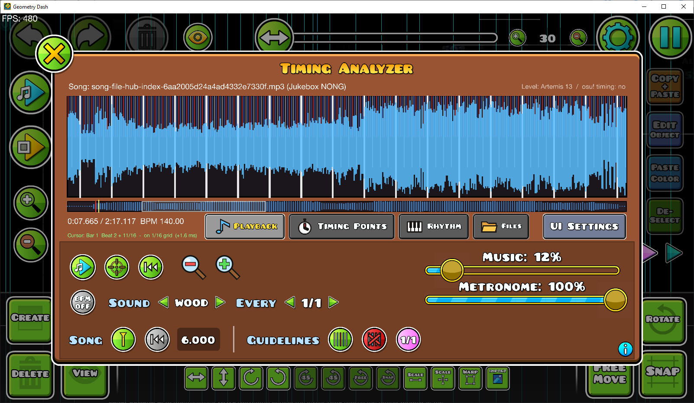
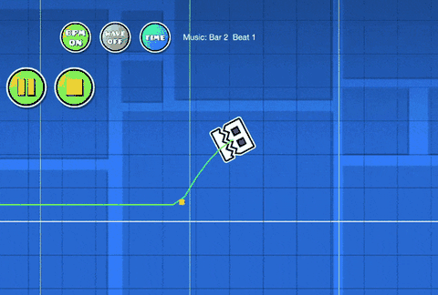
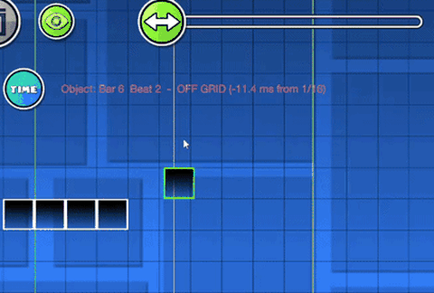

# Geometry Dash Timing Analyzer

An osu!-style timing analyzer for the Geometry Dash level editor (Geode mod) by

> 🤖 **Created with AI**: This mod was built and generated using **Claude Opus 5.5**. Feel free to fork, modify, and adapt it for your own projects!

Load a song, see its waveform, let the mod find the BPM, tempo changes and first beat, fine-tune the
timing points like in osu!, and build your level exactly on the beat.

## Features

- **Waveform** with a beat grid (1/1 ... 1/16), zoom and scrolling, in four tabs: Playback, Timing Points, Rhythm, Files
- **Automatic analysis** of the BPM, tempo changes and first beat
- **Editable timing points** with **undo / redo**
- **Rhythm patterns**: a changing rhythm inside one BPM (1/4, then four fast 1/6 hits...)
- **Metronome** shared by the timing window and the editor, with 3 sounds and an accented first beat
- **Editor buttons**: **BPM** (metronome), **WAVE** (waveform behind the level), **TIME** (opens the timing window
  at the selected object), **1/N** (guideline snap). Movable, resizable and hideable in **UI Settings**
- **Guidelines** made from your timing, updated automatically, in custom colors; **song start offset** from the waveform cursor
- **osu! beatmap import / export**
- **Local songs**: a level can play any mp3 / ogg / wav / flac from your PC (works with Jukebox NONGs)
- **Per-level data**: every level has its own song, timing and settings, exportable as one file

<table>
  <tr>
    <th width="50%">Metronome, beat counter and waveform behind the level</th>
    <th width="50%">Bar / beat of the selected object</th>
  </tr>
  <tr>
    <td></td>
    <td></td>
  </tr>
</table>

## Guide

Every part of the mod is explained in the **[Wiki](../../wiki)**: the timing window, timing points, rhythm patterns,
editor buttons, UI settings, metronome, guidelines, local songs, osu! import, settings, shortcuts and a FAQ.

## Usage

Open it with **Custom Song → Timing** or the **TIME** button in the editor, or drag an audio / `.osu` file
onto the game window. Start with [Getting Started](../../wiki/Getting-Started).

## Installation

Needs **Geometry Dash 2.2081** on **Windows** and **[Geode](https://geode-sdk.org)** 5.10.1 or newer.

1. Download `bychke.gd-timing-analyzer.geode` from [Releases](../../releases)
2. Put it in the `geode/mods` folder of your Geometry Dash
3. Restart the game

> Local songs exist only on your PC: other players won't hear them if you upload the level.

## Building

Needs the [Geode SDK](https://docs.geode-sdk.org/getting-started/sdk) (`GEODE_SDK` variable), the Geode CLI
and Visual Studio Build Tools (C++). Run `build.bat`: it packs `bychke.gd-timing-analyzer.geode` into
`build/` and installs it into the game. GitHub Actions also builds every push.

## License

This project is licensed under the [MIT License](LICENSE) — anyone is free to use, modify, distribute, and build upon this code.

